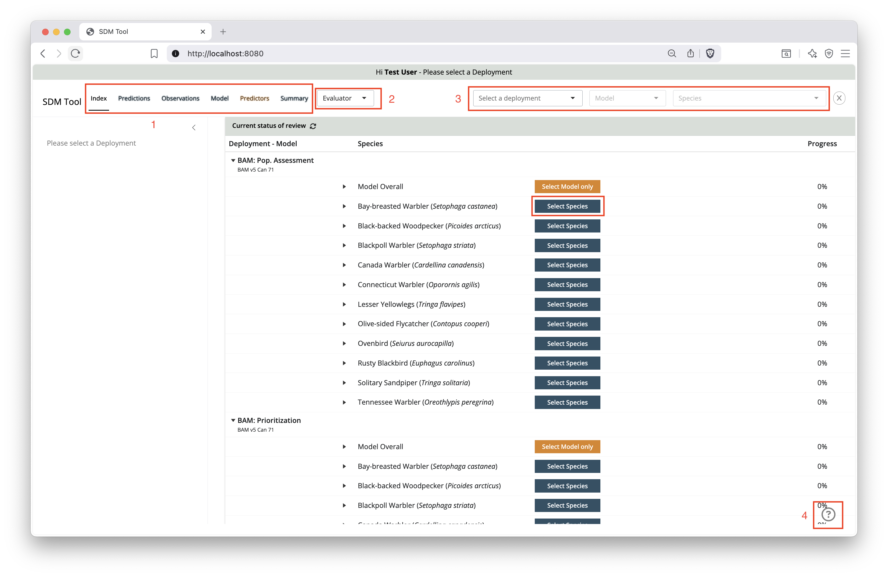
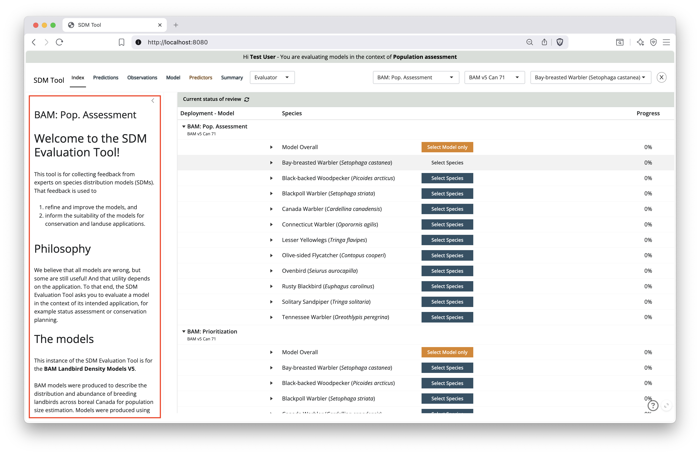
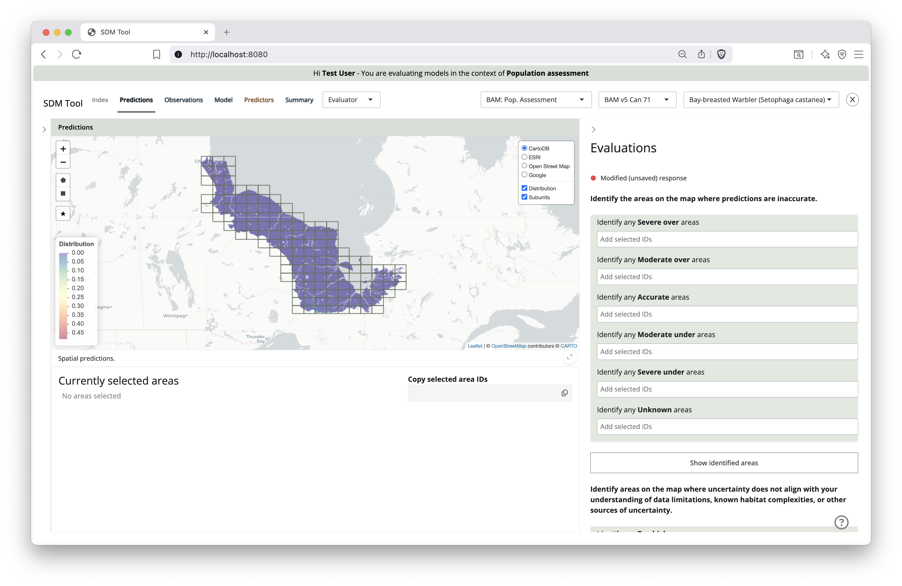
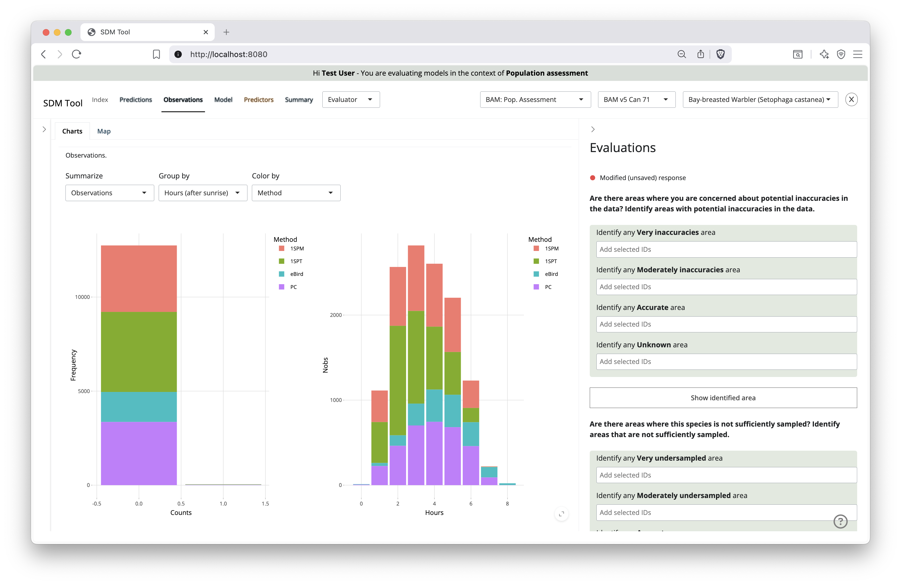
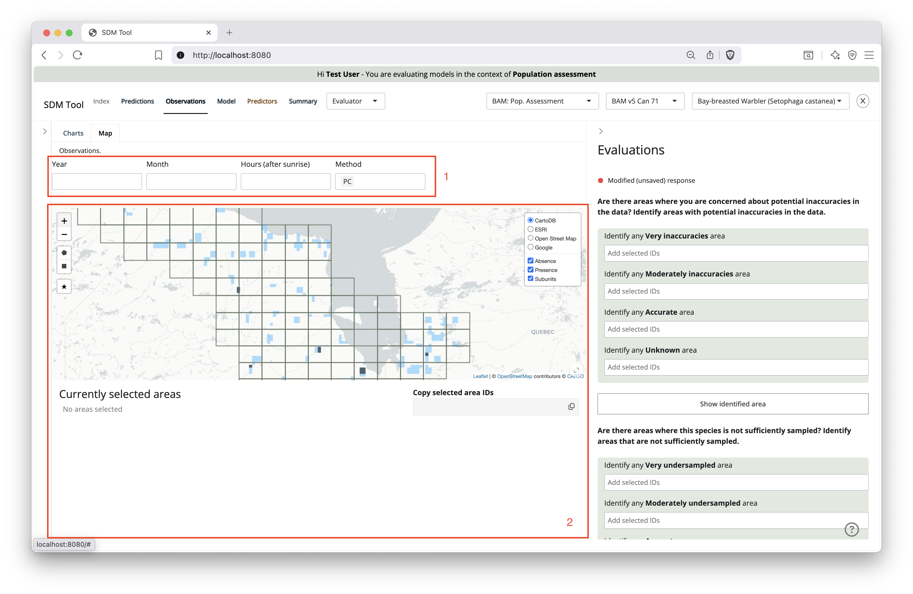
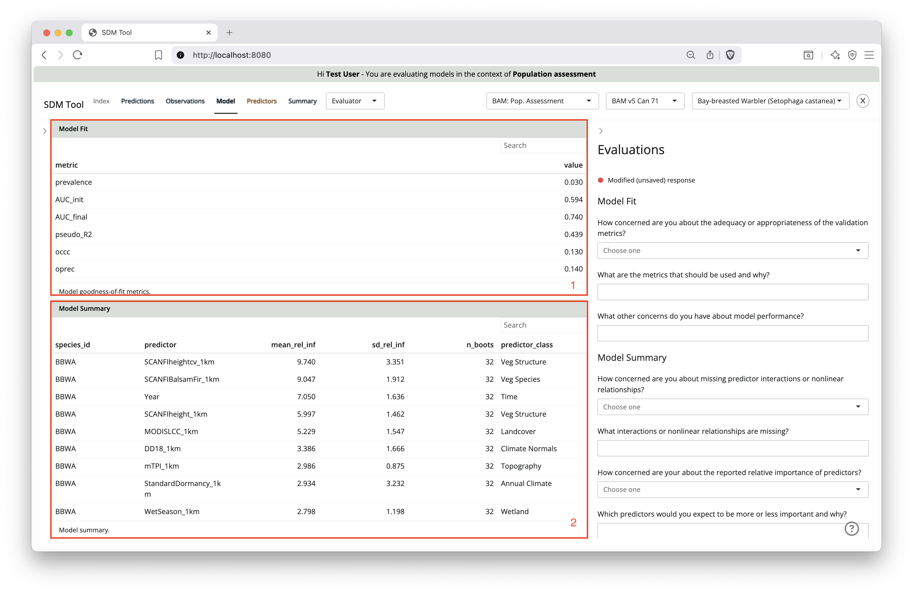
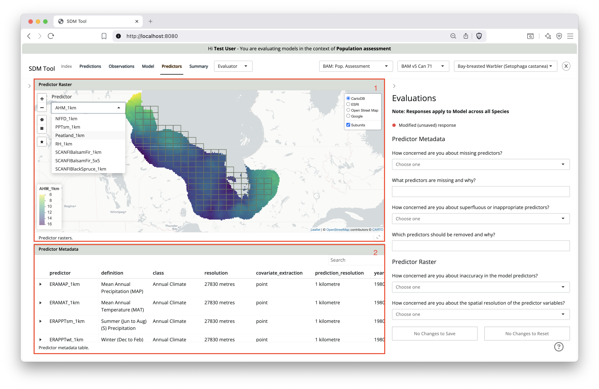
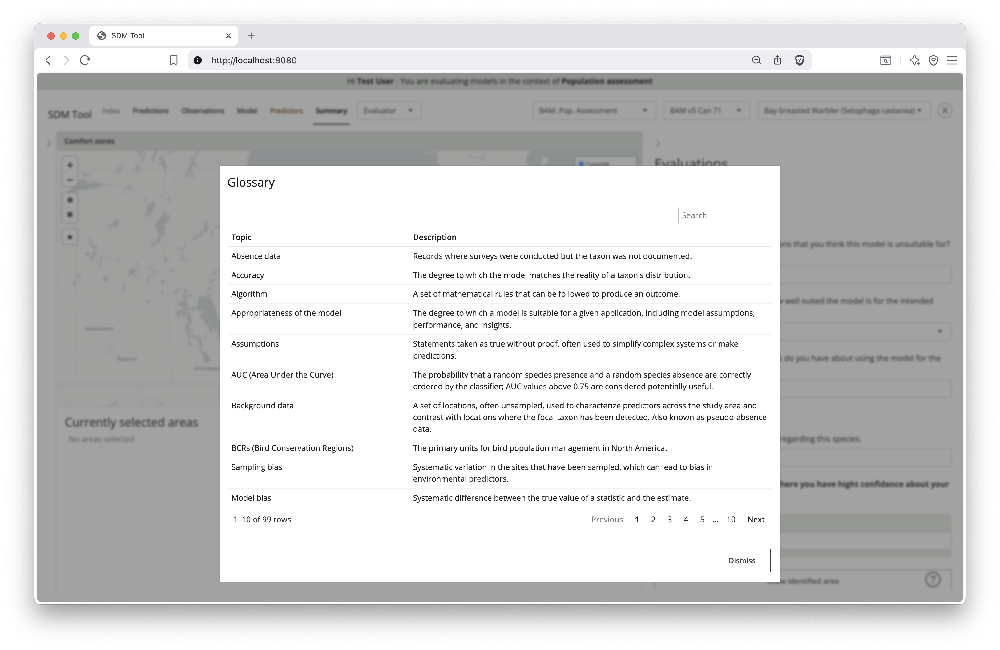
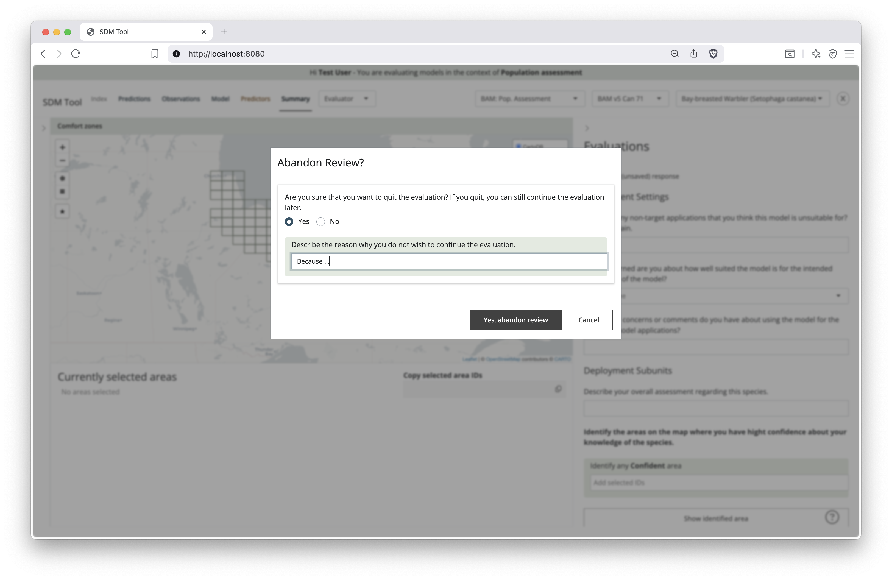
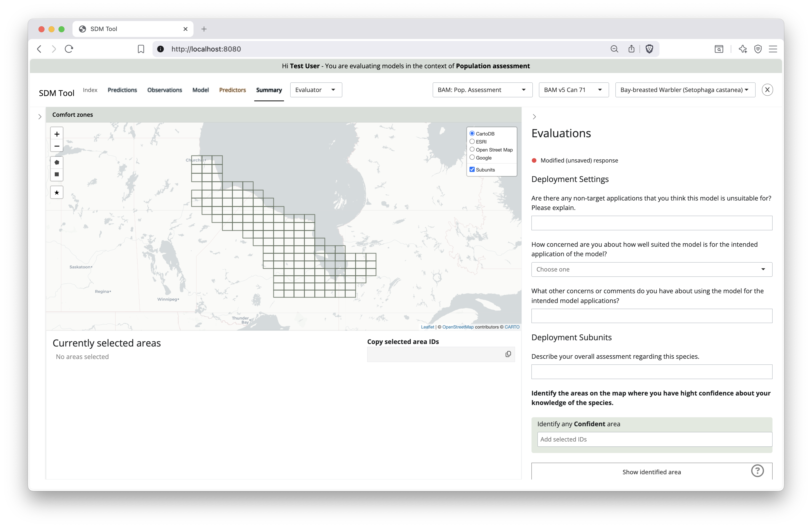

---
output:
  md_document:
    variant: gfm
---

# SDM Model Evaluation Tool User Guide for Evaluators

> How to leave and edit evaluations

## Prerequisites

- [R](https://cran.r-project.org/)
- [Rtools](https://cran.r-project.org/bin/windows/Rtools/) on Windows
- [RStudio Desktop](https://posit.co/download/rstudio-desktop/) or a similar environment of you choosing

Before installation, first create a new RStudio Project where you'll store the 
data required for this tool. To do so, select _File_ > _New Project_. When prompted, select _New Directory_ and _New Project_. Under the field _Directory name_, type in _sdmEvaluationTool_, then, click on the *Browse* button and select a location you'll remember (e.g., `c:/users/user_name/work`).

## Adding the data set

Now download the [sdv_evaluation_results.zip](https://drive.google.com/file/d/12dZ8vpiNuusICc4b1QyREr1NI8HQAM1t/view?usp=drive_link) to your _sdmEvaluationTool_ project folder.
If you have an older version of _sdv_evaluation_results.zip_ in your project folder, replace it with the new version.

## Installation

Use this script in R to install required packages and download/extract the example 
data set (say 'yes' or select the 'All' option to update packages if asked):

```R
source("https://raw.githubusercontent.com/LandSciTech/sdmEvaluationTool/refs/heads/word-refinement/setup_JH.R")
```

Note that if you have a previous deployment of the tool installed, this setup script will move your old results to an _sdm_evaluation_results_old_ folder.

### Running the app locally

Start the app by running the following script in R
(replace the `"testuser"` with your user name):

```R
# load libraries
library(sdmEvalToolCore)
library(sdmEvalToolUI)

# start the app
user_id <- "testuser"
sdm_tool(
  user = user_id,
  tabs = c(
    "overview",
    "predictions",
    "observations",
    "predictors",
    "model",
    "summary"
  )
)
```

A window should pop-up with the loaded app. Alternatively, you can visit the 
following link in your browser: <http://localhost:7405>.

If you see an error message `Error: Could not connect to database`,
try setting the right folder with `sdmevaltool_options()`:

```R
# use your path here to point to the right folder
sdmevaltool_options(base = "./sdm_evaluation_results")
```

## Navigation

The landing page shows an evaluator all the deployments.
Each deployment lists the model related materials (orange buttons)
and the species related materials (blue buttons).
The percentages on the right show the overall progress.
Clicking the chevrons left of the species names opens up a table
showing the progress of the evaluation materials.

The left side of the top navigation (1) lets you go through the tabs, each tab showing
one or two deployment materials. Tabs with blue letters refer to materials
for species, tabs with orange letters refer to model level results.
You can change the user role (2) if you have any other roles.

Select a deployment and model from the dropdown menus at the right
side of the top navigation (3), and select a species (4). You can also click the orange/blue buttons
to make a similar selection. Model purpose, evaluation questions, and evaluation polygons can differ among deployments, allowing the evaluation process to be tailored to the specific needs of modelers, users and evaluators. In the "Simple for population assessment" example deployment we have provided much larger evaluation polygons, removed followup questions, and removed questions about the model that would be difficult for a non-modeler to answer. Deployment, model, and species selections determine what is shown in the other tabs. You can return to the Index tab at any time or use the
top navigation to make changes to these values.

Clicking the question mark icon in the bottom right corner of the page (5)
opens the glossary.



Once a deployment is selected, you'll see a welcome message and instructions on the right.
You can hide this message by clicking the arrow in the top right corner.
The message can be made visible again by clicking the arrow.



## Model materials

### Spatial predictions

The main part of the tabs is the deployment material and the
evaluation area on the right. The evaluations can be hidden to make the
main area larger. Scroll up and down in the evaluations area.



Spatial predictions are shown as raster layers in the interactive map.
Select the base layer, turn on the Distribution or or Uncertainty layers.
There is also a Subunits layer that is used for spatial evaluations (see below).

Click the Expand button (bottom right corner of the cards that contain the
maps, tables, etc.) to pop the material into a full-screen mode.

### Observations

The observations tab has a Charts and a Map component.
Select the options for the charts (1) and the observations summaries (2)
will change accordingly.



In the map, there are also dropdowns to filter the observations by (1).
In the map (2), change the base layers, and turn on/off the Absences
and Presences, also the Subunits.



### Model fit and summary

The model fit (1) and model summary (2) is shown in the same tab.



### Predictors

The Predictors tab contains the Predictor Raster (1) map, use the dropdown
to change the layer. The predictor metadata (2) table is at the bottom.
Use the expand button to make them pop to full-screen.



### Glossary

Click the question mark icon in the bottom right corner of the page
opens the glossary. Search for words by typing into the Search area.
As a result, you'll see topics and descriptions in which the world appear.



## Evaluations

### Spatial evaluations

### Non-spatial evaluations

### Abandoning and resuming evaluations

The `X` icon in the top right corner (3) is to "abandon" the review (see more on this below).




### Summary



