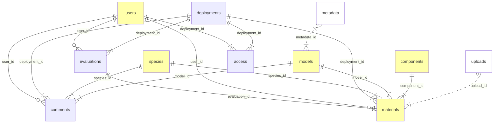

---
output:
  md_document:
    variant: gfm
---

```{r, echo = FALSE}
library(knitr)
knitr::opts_chunk$set(
    echo = FALSE,
    results = "asis",
    warning = FALSE,
    error = FALSE,
    message = FALSE,
    collapse = TRUE,
    comment = "",
    fig.path = "README-")
conf <- yaml::read_yaml("config.yml")
fields <- do.call(rbind, lapply(names(conf$tables), \(i) {
    l <- conf$tables[[i]]$fields
    data.frame(table=i, do.call(rbind, lapply(names(l), \(j) {
        k <- l[[j]]
        k[sapply(k, is.null)] <- NA_character_
        data.frame(field=j, as.data.frame(k))
    })))
}))
code <- function(x, link=FALSE)  {
    q <- paste0("`", x, "`")
    if (link) {
        q <- paste0("[", q, "](#", x, ")")
    }
    ifelse(!is.na(x) & nchar(x) > 0, q, x)
}
show_tab <- function(tn, ...) {
    z <- fields[fields$table == tn, ]
    z$field <- code(z$field)
    z$constraint <- code(z$constraint)
    z$constraint[is.na(z$constraint)] <- ""
    z0 <- z[,c("field", "type", "constraint", "description")]
    knitr::kable(z0, row.names = FALSE, ...)
}
show_section <- function(tn, ...) {
    cat(paste0("### ", conf$tables[[tn]]$name, " (", code(tn), ")\n\n"))
    cat(conf$tables[[tn]]$description, "\n")
    print(show_tab(tn, ...))
    cat("\n")
}
show_comps <- function(tn, ...) {
    cat(paste0("### ", conf$components[[tn]]$display$title, " (", code(tn), ")\n\n"))
    cat(conf$components[[tn]]$description, "\n\n")
    cat("**Mandatory**: ", ifelse(conf$components[[tn]]$mandatory, "Yes", "No"), "\n\n")
    cat("**Input**: ", conf$components[[tn]]$upload$input$description, "\n\n")
    cat("**Output**: ", conf$components[[tn]]$upload$output$description, "\n\n")
    cat("Output path: ", code(conf$components[[tn]]$upload$output$path), "\n\n")
    cat("**Display**: ", conf$components[[tn]]$display$description, "\n\n")
}

```

# SDM Model Evaluation Tool (MET)

## Objective

MET that will enable NOBMWG members to:

- evaluate bird SDMs;
- develop methods for synthesizing expert evaluations with quantitative
  evaluations to inform model improvement and application; and
- to assess what more (if anything) is needed to improve the bird SDM evaluation
  process.

MET attributes include:

1.  **Modular**: The MET consists of independent Modules, each
    handling specific functionality. This minimizes duplication of code within 
    and among Modules and links Modules into a usable tool.
2.  **Flexible**: The MET code is stored and shared in a GitHub
    repository that allows ECCC and other Tool Maintainers in the NOBMWG
    to add to or modify all components of the MET.
3.  **Expandable**: The MET allows for the possibility of adding new
    Modules created by Tool Maintainers in future.
4.  **Portable**: Tool Maintainers will be able to run the MET locally
    on their computers with minimal changes, and will understand
    possible future server deployment options and procedures.
5.  **Generalizable**: The MET allows for a variety of species, SDM
    model types, and geographies.
6.  **Spatially explicit**: Users will be able to visualize, interact
    with, and provide feedback on multiple raster and vector layers
    (predictions, uncertainty, covariates, etc).
7.  **Open source**: MET code will be released under a suitable open source 
    software license that is compatible with the ODMAP v1 project dependency.
8.  **Comparative**: Users will be able to view outputs from multiple
    models (e.g., predictions of multiple species), either side by side
    or by toggling among layers, to gain a deeper understanding of model
    outputs.
9.  **Multiple formats**: Users must be able to upload, view and
    interact with Model Materials in a variety of formats (text, tables,
    rasters, vectors).

## Conceptual model



## Tables

The table descriptions establish the keys, define field constraints,
and list the required field names. It is possible to have fields in these tables other than what is listed if the names are unique across tables (e.g. prefixed with the singular version of the table name).

Table names are lower case (a single plural noun). Field names are snake case (lower case with underscores as word separator).

```{r}
for (i in names(conf$tables))
    show_section(i)
```

## Users and user roles

Allowed values and access types for user roles:

| Role | Model materials | Evaluations | Discussions |
|--|--|--|--|
| `viewer` | Read | Read | None |
| `commenter` | Read | Read | Read, Write |
| `evaluator` | Read | Read, Write (create new, edit theirs) | Read, Write |
| `modeler` | Read, Write (create new, edit theirs) | Read | Read, Write |
| `admin` | Read, Write (create new, edit all, delete) | Read, Write (create new, edit all, delete) | Read, Write |

The UI will enforce role based access rules.

The `users` table needs to be updated regularly, requires admin access and 
writing directly to the database.

The admin role cannot be selected by users when setting up deployment access 
roles for other users.

When providing multiple roles to a user, the user will have the union of
privileges associated with those roles.

## Components

The configuration for components outlines the materials upload expectations.
We specify what expect the **inputs** and the **outputs** to look like.
The `path` property tells where to look for the result from this component.

The display section of the component specification determines what kind of
functionality is required. We have corresponding `mod_<component_id>_ui` and 
`mod_<component_id>_server` module functions to be used in the Shiny app.
The placement of the component can also be determined here, i.e. which
page/tab/section it will be displayed.

```{r}
for (i in names(conf$components))
    show_comps(i)
```

## Materials upload

When materials are uploaded, we expect the following sequence of actions:

1. Metadata is uploaded or entered, this will allow to identify the model
3. Once the model is identified, we can also upload predictor variable info (maps, descriptions)
2. We can also upload the species information:
   - Spatial predictions (density, coefficient of variation)
   - Observations
   - Model summaries (coefficients, variable importance)
   - Model fit metrics

We are following the model/species nesting order, but the list of potential
species is the same for all models.

Input files can be provided in different formats (csv, rda, parquet, gpkg).
We write flat files in rda or parquet formats because these are fast to read/write, compact,
and type-safe (i.e. preserves dates). It can also be used to store
spatial information for vector layers.
Spatial raster files are saved as multi-band TIF files.

When the info is uploaded, we organize the files inside the `./materials/` folder the following way:

```text
./sdm_evaluation_db.sqlite

./materials/<model_id>/
./materials/<model_id>/metadata/model_metadata.parquet
./materials/<model_id>/predictors/predictor_metadata.parquet
./materials/<model_id>/predictors/predictor_raster.tif            # *

./materials/<model_id>/species/<species_id>/
./materials/<model_id>/species/<species_id>/observations.parquet
./materials/<model_id>/species/<species_id>/spatial_prediction.tif
./materials/<model_id>/species/<species_id>/model_summary.parquet
./materials/<model_id>/species/<species_id>/model_fit.parquet

./deployments/{deployment_id}/questions.csv
./deployments/{deployment_id}/subunits.gpkg
```

Model materials are saved after upload, this is also when the database
is updated with the new information.

Questions will have an expected table format, and a csv file can be uploaded
similarly to metadata. In the absence of a usecase, the default
question template will be used.

Subunits can be used to make evaluations more specific. In the 1st phase,
we will make sure subunits can be identified (popups, paste ID to clipboard).
In next phase, we will develop more sophisticated ways of providing
subunit level feedback if this is identified as a priority.
If no subunits are provided for a usecase, the subunits will not show.

The evaluations for each material are stored in the SQLite database, alongside the
other tables outlined in the conceptual overview.

## Future changes to consider

Repeatedly storing some of the materials will not be sustainable.
We will revisit organizing predictor variables independently,
this way the evaluation app will have the ability to link to it.
If this is a file server, we can have static HTML files displaying rasters:

```bash
./shared/predictors/<predictor_id>/predictor_raster.tif
./shared/predictors/<predictor_id>/index.html
```
