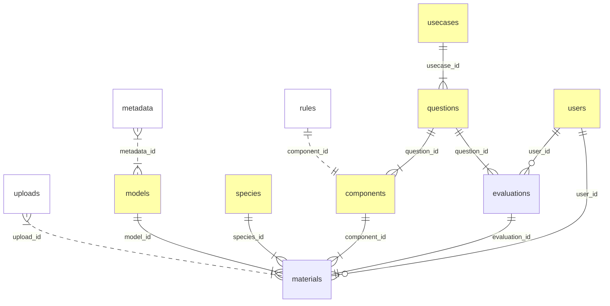

---
output:
  md_document:
    variant: gfm
---

```{r, echo = FALSE}
library(knitr)
knitr::opts_chunk$set(
    echo = FALSE,
    results = "asis",
    warning = FALSE,
    error = FALSE,
    message = FALSE,
    collapse = TRUE,
    comment = "",
    fig.path = "README-")
conf <- yaml::read_yaml("config.yml")
fields <- do.call(rbind, lapply(names(conf$tables), \(i) {
    l <- conf$tables[[i]]$fields
    data.frame(table=i, do.call(rbind, lapply(names(l), \(j) {
        k <- l[[j]]
        k[sapply(k, is.null)] <- NA_character_
        data.frame(field=j, as.data.frame(k))
    })))
}))
code <- function(x, link=FALSE)  {
    q <- paste0("`", x, "`")
    if (link) {
        q <- paste0("[", q, "](#", x, ")")
    }
    ifelse(!is.na(x) & nchar(x) > 0, q, x)
}
show_tab <- function(tn, ...) {
    z <- fields[fields$table == tn, ]
    z$field <- code(z$field)
    z$constraint <- code(z$constraint)
    z$constraint[is.na(z$constraint)] <- ""
    z0 <- z[,c("field", "type", "constraint", "description")]
    knitr::kable(z0, row.names = FALSE, ...)
}
show_section <- function(tn, ...) {
    cat(paste0("### ", conf$tables[[tn]]$name, " (", code(tn), ")\n\n"))
    cat(conf$tables[[tn]]$description, "\n")
    print(show_tab(tn, ...))
    cat("\n")
}
show_comps <- function(tn, ...) {
    cat(paste0("### ", conf$components[[tn]]$display$title, " (", code(tn), ")\n\n"))
    cat(conf$components[[tn]]$description, "\n\n")
    cat("**Input**: ", conf$components[[tn]]$upload$input$description, "\n\n")
    cat("**Output**: ", conf$components[[tn]]$upload$output$description, "\n\n")
    cat("Output path: ", code(conf$components[[tn]]$upload$output$path), "\n\n")
    cat("**Display**: ", conf$components[[tn]]$display$description, "\n\n")
}

```

# SDM Evaluation Tool

## Conceptual model



## Tables

The table descriptions establish the keys, define field constraints,
and list the required field names. It is possible to have fields in these tables other than what is listed if the names are unique across tables (e.g. prefixed with the singular version of the table name).

Table names are lower case (a single plural noun). Field names are snake case (lower case with underscores as word separator).

```{r}
for (i in names(conf$tables))
    show_section(i)
```

## Notes

Allowed values and access types for user roles:

| Role | Model materials | Evaluations |
|--|--|--|
| `viewer` | Read | Read |
| `evaluator` | Read | Read, Write (create new, edit theirs) |
| `modeler` | Read, Write (create new, edit theirs) | Read |
| `admin` | Read, Write (create new, edit all, delete) | Read, Write (create new, edit all, delete) |

This table needs to be updated regularly, requires admin access and writing directly
to the database.

Mandatory components are prerequisites for starting evaluations.
After initial development, versioning and backward compatibility should be a concern so that previous entries will not break.

FIXME: need to link this to uploads (upload entries, files).

The UI will enforce role based access rules.

Note: the body has to conform with component display rules which is not checked by the database and is the job for the UI to enforce.

Display rule for comments are simpler than for evaluations, we consider text comments for now.

Updates to evaluations will be frequent as evaluators provide more data.
Every new entry and edit will be saved with user ID and timestamp
when Save button is clicked after adding the entry.

## Components

```{r}
for (i in names(conf$components))
    show_comps(i)
```

### Model materials upload

Single and multi-species uploads are defined here.
We can define what kind of component it is, e.g. a table, a raster file, etc.
What kind of files are accepted, how to parse multi-species results (i.e.
species are columns, or rows, what columns are expected for tables).
The `path` property tells where to look for the result from this component.

### Display

The display section of the component specification determines what kind of
functionality is required. We have corresponding `mod_<component_id>_ui` and 
`mod_<component_id>_server` module functions to be used in the Shiny app.
The placement of the component can also be determined here, i.e. which
page/tab/section it will be displayed.

### Evaluation

This specifies what kind of evaluation is to be implemented for the component.

FIXME: add more content here.

### Reporting

This specifies how to summarize the component in reports.

FIXME: add more content here.

## Materials upload

When materials are uploaded, we expect the following sequence of actions:

1. Metadata is uploaded or entered, this will allow to identify the model
3. Once the model is identified, we can also upload predictor variable info (maps, descriptions)
2. We can also upload the species information:
   - Observations
   - Model summaries (coefficients, variable importance)
   - Spatial predictions (density, coefficient of variation)
   - Model fit metrics

We are following the model/species nesting order, but the list of potential
species is the same for all models.

Input files can be provided in different formats (csv, rda, parquet, gpkg).
We write flat files in rda or parquet formats because these are fast to read/write, compact,
and type-safe (i.e. preserves dates). It can also be used to store
spatial information for vector layers.
Spatial raster files are saved as multi-band TIF files.

When the info is uploaded, we organize the files inside the `./materials/` folder the following way:

```text
./materials/<model_id>/
./materials/<model_id>/model_metadata.parquet
./materials/<model_id>/predictors/predictor_metadata.parquet
./materials/<model_id>/predictors/predictor_raster.tif

./materials/<model_id>/species/<species_id>/
./materials/<model_id>/species/<species_id>/observations.parquet
./materials/<model_id>/species/<species_id>/spatial_prediction.tif
./materials/<model_id>/species/<species_id>/model_summary.parquet
./materials/<model_id>/species/<species_id>/model_fit.parquet
```

Model materials are saved after upload, this is also when the database
is updated with the new information.

Questions for the usecases are saved as:

```text
./materials/<model_id>/usecases/<usecase_id>/questions.parquet
```

## Database and evaluations

The evaluations for each material are stored in a database, alongside the
other tables outlined in the conceptual overview.
For the local file system setup, the database is placed as follows:

```text
./sdm_evaluation_db.sqlite
```

## TODO

- [x] Make YAML for components
- [ ] Describe single/multi-species upload specs
- [x] Outline mandatory component displays specs
- [ ] Describe a framework for more flexible handling of GoF components
- [ ] Create mock app UI for summary, spp1 landing, etc

