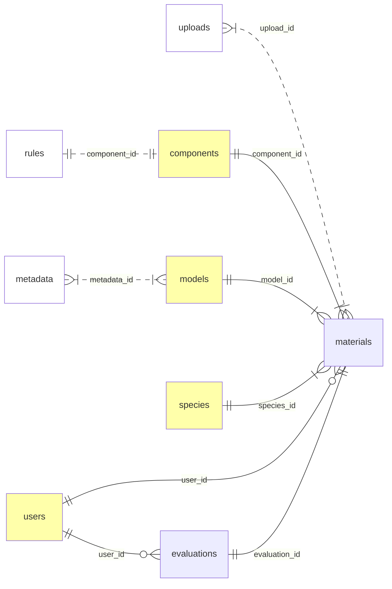

# Documentation for the SDM Evaluation Tool

## Conceptual model

## Tables

The table descriptions establish the keys, define field constraints,
and list the required field names. It is possible to have fields in these tables other than what is listed if the names are unique across tables (e.g. prefixed with the singular version of the table name).

Table names are lower case (a single plural noun). Field names are snake case (lower case with underscores as word separator).

### `species`

A table that lists all potential species, in our case, birds in Canada.

| Field name | Type | Constraints | Description |
|------------|------|-------------|-------------|
|  `species_id`  |  text  |  `PRIMARY KEY`  |  Lower case 4-letter code, e.g. `oven` for Ovenbird. |
|  `scientific_name`  |  text  |  `UNIQUE NOT NULL`  |  Scientific name.  |
|  `english_name`  |  text  |  `UNIQUE NOT NULL`  |  Common name in English.  |
|  `french_name`  |  text  |  `UNIQUE NOT NULL`  |  Common name in French (use UTF-8 encoding).  |

### `models`

A table listing models. The model name and ID acts as an abbreviation of the model approach/extent/etc. and also acts as a version identifier, e.g. `can_glm_v1.1` would mean that GLM models were used for models with Canadian extent and this is version 1.1.

| Field name | Type | Constraints | Description |
|------------|------|-------------|-------------|
|  `model_id`  |  text  |  `PRIMARY KEY`  |  Model ID, lower case, alphanumeric, `.` and `_` allowed.  |
|  `model_name`  |  text  |  `UNIQUE NOT NULL`  |  A human readable version of `model_id` displayed in the app.  |
|  `model_description`  |  text  |  `UNIQUE NOT NULL`  |  A brief model description.  |
|  `model_metadata`  |  text  |  `UNIQUE NOT NULL`  |  A file path or URL pointing used to find the ODMAP metadata for the model.  |

### `users`

| Field name | Type | Constraints | Description |
|------------|------|-------------|-------------|
|  `user_id`  |  text  |  `PRIMARY KEY`  |  User ID (a unique ID or the email).  |
|  `user_name`  |  text  |  `NOT NULL`  |  The user's full name.  |
|  `user_email`  |  text  |  `UNIQUE NOT NULL`  |  The user's email address.  |
|  `user_affiliation`  |  text  |  `NOT NULL`  |  The user's primary affiliation, e.g. ECCC, BAM, etc.  |
|  `user_roles`  |  text  |    |  A comma separated list of user roles, e.g. `modeler,evaluator`. The default role is `viewer` and is assumed even if not mentioned explicitly (value is null). |

Allowed values and access types for user roles:

| Role | Model materials | Evaluations |
|--|--|--|
| `viewer` | Read | Read |
| `evaluator` | Read | Read, Write (create new, edit theirs) |
| `modeler` | Read, Write (create new, edit theirs) | Read |
| `admin` | Read, Write (create new, edit all, delete) | Read, Write (create new, edit all, delete) |

### `components`

Components that can be uploaded and evaluated. Each component will have its Shiny module implementing the expected behavior for upload, display, and evaluation. e.g. a component can have corresponding `mod_<component_id>_ui` and `mod_<component_id>_server` module functions.

| Field name | Type | Constraints | Description |
|------------|------|-------------|-------------|
|  `component_id`  |  text  |  `PRIMARY KEY`  |  Component ID, lower case with `_`, also used in Shiny module names.  |
|  `component_description`  |  text  |  `NOT NULL`  |  Component description.  |
|  `component_mandatory`  |  boolean  |  `NOT NULL`  |  Is the component mandatory (value is `TRUE`).  |
|  `component_placement`  |  text  |  `NOT NULL`  |  A label that helps placing the component in the UI. E.g. reflecting which page/tab/section it belongs and how it should be ordered relative to other components.  |
|  `component_rules`  |  json  |  `NOT NULL`  |  JSON document to describe upload/display/evaluation/reporting behavior.  |

FIXME: MORE WORK NEEDED ON COMPONENTS, organize into sections to help with UI organization (page_tab_section, ordering, etc.) similarly to ODMAP dict.

FIXME: outline expectations re upload (file type, etc.) and evaluation in YAML (`components.yaml`). Use this YAML to generate this table, possibly using a json field to store document style properties to encapsulate expected behavior.

Mandatory components are prerequisites for starting evaluations.

### `materials`

Upload materials are used to be displayed and evaluated.

| Field name | Type | Constraints | Description |
|------------|------|-------------|-------------|
|  `material_id`  |  text  |  `PRIMARY KEY`  |  ID for joining feedback to materials (in the form of `<species_id>_<model_id>_<component_id>`).  |
|  `species_id`  |  text  |  `REFERENCES species`  |  Species ID.  |
|  `model_id`  |  text  |  `REFERENCES models`  |  Model ID.  |
|  `component_id`  |  text  |  `REFERENCES components`  |  Component ID.  |
|  `material_create_user`  |  text  |  `REFERENCES user (user_id)`  |  User who uploaded the model material.  |
|  `material_create_time`  |  timestamp  |  `NOT NULL`  |  Time of initial upload.  |
|  `material_modify_user`  |  text  |  `REFERENCES user (user_id)`  |  User who modified the model material.  |
|  `material_modify_time`  |  timestamp  |  `NOT NULL`  |  Time of last modification.  |

FIXME: need to link this to uploads (upload entries, files).

Note: we can consider adding a lock field, i.e. locked for modifications because evaluations have started. For now, a soft lock is considered when all mandatory fields are available for a species/model combo.

Note: the UI will enforce role based access rules.

### `evaluations`

Evaluations are the basic feedback on the materials.
There is no explicitly defined primary key, sort and filter to find entries to display.
User ID is the create user.

| Field name | Type | Constraints | Description |
|------------|------|-------------|-------------|
|  `material_id`  |  text  |  `REFERENCES materials`  |  Material ID.  |
|  `evaluation_create_user`  |  text  |  `REFERENCES users (user_id)`  |  User ID.  |
|  `evaluation_create_time`  |  timestamp  |  `NOT NULL`  |  Time of initial evaluation.  |
|  `evaluation_modify_user`  |  text  |  `REFERENCES users (user_id)`  |  User who last modified.  |
|  `evaluation_modify_time`  |  timestamp  |  `NOT NULL`  |  Time of last modification.  |
|  `evaluation_body`  |  json  |  `NOT NULL`  |  JSON blob with the evaluation according to component display rules reflecting last modification.  |
|  `comment_create_user`  |  text  |  `REFERENCES users (user_id)`  |  User ID.  |
|  `comment_create_time`  |  timestamp  |    |  Time of initial evaluation.  |
|  `comment_modify_user`  |  text  |  `REFERENCES users (user_id)`  |  User who last modified.  |
|  `comment_modify_time`  |  timestamp  |    |  Time of last modification.  |
|  `comment_body`  |  json  |    |  JSON blob with the comment on an evaluation according to component display rules reflecting last modification.  |

Note: the UI will enforce role based access rules.

Note: the body has to conform with component display rules which is not checked by the database and is the job for the UI to enforce.

Display rule for comments are simpler than for evaluations, we consider text comments for now.

## Components

Here we describe everything we need to know about the components.

See [`components.yml`](./components.yml)

## Model materials upload

Single and multi-species uploads.

## TODO

- [ ] Make YAML for components
- [ ] Describe single/multi-species upload specs
- [ ] Outline mandatory component displays specs
- [ ] Describe a framework for more flexible handling of GoF components
- [ ] Outline mandatory component evaluation specs
- [ ] Create mock app UI for summary, spp1 landing, etc
